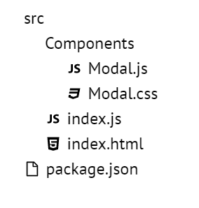

Hey folks! I hope you are doing fine in this pandemic situation, Today we will be creating a Folder Tree Component in
Reactjs from scratch.

## Designing the API

Before creating any type of component in reactjs you should 1st design how the API would look like and then write the
neccessary code to make it work.

**Our Folder Tree Component will have two APIs**

- Declarative
- Imperative

At first we will tackle the Declarative API which is really simple to create,  
and in the second section we will do the Imperative API with recursive components.

### Declarative API

The declarative API would look something like this :-

```jsx
import Tree from './Tree';

const App = () => {
  return (
    <div>
      <Tree>
        <Tree.Folder name="src">
          <Tree.Folder name="Components">
            <Tree.File name="Modal.js" />
            <Tree.File name="Modal.css" />
          </Tree.Folder>
          <Tree.File name="index.js" />
          <Tree.File name="index.html" />
        </Tree.Folder>
        <Tree.File name="package.json" />
      </Tree>
    </div>
  );
};
```

As you can see we will have total of three components to work with

- <Tree \/> (the root)
- <Tree.Folder \/> (it will be collapsible)
- <Tree.File \/>

### Imperative API

Declarative APIs are simple & easier for users to structure the Tree, but in real world scenarios we will have a JSON
Object representing the Folder Tree and we need to render that with the Imperative API.

```jsx
import Tree from './Tree';

const structure = [
  {
    type: "folder",
    name: "src",
    childrens: [
      {
        type: "folder",
        name: "Components",
        childrens: [
          { type: "file", name: "Modal.js" },
          { type: "file", name: "Modal.css" }
        ]
      },
      { type: "file", name: "index.js" },
      { type: "file", name: "index.html" }
    ]
  },
  { type: "file", name: "package.json" }
];

const App = () => {
  return (
    <div>
      <Tree data={structure} />
    </div>
  );
};
```

As you can see we have a JSON representation of the same tree we have in our declarative API.  
Its an Array of Objects and each object has three properties

- name
- type (defines if its a Folder or File)
- childrens (array of nested Files & Folders)

And we just passed this `structure` to our <Tree \/> component which will handle the rendering, we will cover the
Imperative API later in the post but let us first finish our Declerative API

---

### The Tree Component

Lets first install styled-components for styling our Components.

```sh
npm install styled-components
```

Our Tree component will be very simple it will only have some basic styling, it is so simple i don't even have to
explain it.

```jsx
const StyledTree = styled.div`
  line-height: 1.5;
`;

const Tree = ({ children }) => {
  return <StyledTree>{children}</StyledTree>;
};
```

### The File Component

In our File component we will also have a File Icon with some basic styling.

Lets install [react-icons](https://www.npmjs.com/package/react-icons) and import our File Icon

```sh
npm install react-icons
```

```jsx
import { AiOutlineFile } from 'react-icons/ai';

const StyledFile = styled.div`
  padding-left: 20px;
  display: flex;
  align-items: center;
  span {
    margin-left: 5px;
  }
`;

const File = ({ name }) => {
  return (
    <StyledFile>
      <AiOutlineFile />
      <span>{name}</span>
    </StyledFile>
  );
};
```

We have a 20px padding left to push the Component to the right a little bit, and display flex properties to align the
icon & span correctly.

Thats fine but that generic file icon does not look good, does it? lets change that.  
We will make a map of extension icons and depending on the file extension we will give the file appropriate icon.

```jsx
import { DiJavascript1, DiCss3Full, DiHtml5, DiReact } from 'react-icons/di';

const FILE_ICONS = {
  js: <DiJavascript1 />,
  css: <DiCss3Full />,
  html: <DiHtml5 />,
  jsx: <DiReact />,
};
export default FILE_ICONS;
```

And in the File component we will extract the extension from the name of the file and use that to render the icon

```jsx
import FILE_ICONS from './FileIcons';

const File = ({ name }) => {
  // get the extension
  let ext = name.split('.')[1];

  return (
    <StyledFile>
      {/* render the extension or fallback to generic file icon  */}
      {FILE_ICONS[ext] || <AiOutlineFile />}
      <span>{name}</span>
    </StyledFile>
  );
};
```

It would look something like this.  
Hooray our File component is done, let's move on to Folder component



### The Folder Component

In the Folder component we will have

- folder title
- collapsible component
- Nested childrens of File/Folder components

Initially our Folder component is very simple, just the title and childrens.

> btw if you dont know what that `children` prop is then heres some resources  
> [A quick intro to React’s props.children](https://codeburst.io/a-quick-intro-to-reacts-props-children-cb3d2fce4891)  
> [A deep dive into children in React](https://mxstbr.blog/2017/02/react-children-deepdive)

```jsx
import { AiOutlineFolder } from 'react-icons/ai';

const StyledFolder = styled.div`
  padding-left: 20px;

  .folder--label {
    display: flex;
    align-items: center;
    span {
      margin-left: 5px;
    }
  }
`;

const Folder = ({ name, children }) => {
  return (
    <StyledFolder>
      <div className="folder--label">
        <AiOutlineFolder />
        <span>{name}</span>
      </div>
      <div>{children}</div>
    </StyledFolder>
  );
};
```

And thats it, thats all we need for our Folder component but we also wanted the folders to be collapsible so lets add
that next.

To add the collapse feature we will add a <Collapse \/> Styled component and also add local state to keep track of
`isOpen` state of our component.

```jsx
const StyledFolder = styled.div`
  padding-left: 20px;

  .folder--label {
    display: flex;
    align-items: center;
    span {
      margin-left: 5px;
    }
  }
`;
const Collapsible = styled.div`
  /* set the height depending on isOpen prop */
  height: ${p => (p.isOpen ? 'auto' : '0')};
  /* hide the excess content */
  overflow: hidden;
`;

const Folder = ({ name, children }) => {
  const [isOpen, setIsOpen] = useState(false);

  const handleToggle = e => {
    e.preventDefault();
    setIsOpen(!isOpen);
  };

  return (
    <StyledFolder>
      <div className="folder--label" onClick={handleToggle}>
        <AiOutlineFolder />
        <span>{name}</span>
      </div>
      <Collapsible isOpen={isOpen}>{children}</Collapsible>
    </StyledFolder>
  );
};
```

There we go! Our Folder Component is done, Yey!

### Finalizing Tree Component

As you've noticed in our Declerative API design, we have <Tree.File \/> & <Tree.Folder \/> components we can just assign
the File & Folder component to our Tree's static methods.

```jsx
const Tree = ({ children }) => {
  return <StyledTree>{children}</StyledTree>;
};

Tree.File = File;
Tree.Folder = Folder;

////////
// DONE! Lets try it out
import Tree from './Tree';

const App = () => {
  return (
    <div>
      <Tree>
        <Tree.Folder name="src">
          <Tree.Folder name="Components">
            <Tree.File name="Modal.js" />
            <Tree.File name="Modal.css" />
          </Tree.Folder>
          <Tree.File name="index.js" />
          <Tree.File name="index.html" />
        </Tree.Folder>
        <Tree.File name="package.json" />
      </Tree>
    </div>
  );
};
```

If we run the code now we will have a working React Folder Tree Component! Congrats 🎉🎉

#### Declerative Demo

https://codesandbox.io/s/react-tree-component-p1-dzrxk

-------

### Imperative API

OKAY! we are done with the Declerative API now lets work on the Imperative API.

To create the Imperative API we need recursion!

> If you are not familiar with recursion then check out some resources  
> [A Quick Intro to Recursion in Javascript](https://www.freecodecamp.org/news/quick-intro-to-recursion/)  
> [Intro to Recursion in JS](https://dev.to/ryanfarney3/intro-to-recursion-in-js-32g)

In our <Tree \/> component we accept the `data` props and added an `isImperative` flag.  
If we have the data prop and not the children that means the user is using the imperative api, and depending on that
variable we will be rendering the tree.

```jsx
const Tree = ({ data, children }) => {
  const isImperative = data && !children;

  return <StyledTree>{isImperative ? <TreeRecursive data={data} /> : children}</StyledTree>;
};
```

As you've noticed we also added a new component called `<TreeRecursive />` which will recursively look through the JSON
structure and render those nested files/folders, Lets implement it.

```jsx
const TreeRecursive = ({ data }) => {
  // loop through the data
  return data.map(item => {
    // if its a file render <File />
    if (item.type === 'file') {
      return <File name={item.name} />;
    }
    // if its a folder render <Folder />
    if (item.type === 'folder') {
      return (
        <Folder name={item.name}>
          {/* Call the <TreeRecursive /> component with the current item.childrens */}
          <TreeRecursive data={item.childrens} />
        </Folder>
      );
    }
  });
};
```

Believe it or not, we are DONE! 🎉🎉 Run the code and see the magic!

#### Imperative Demo

https://codesandbox.io/s/react-tree-component-p2-ngoqe


Phew! That was amazing isn't it? if you made it this far, give yourself a tap on the shoulder because you just built a React Folder Tree Component!

Now for those who are looking for some more fun try to implement these features on your own :-

- File/Folder Rename Support
- File/Folder Creation Support
- File/Folder Deletion Support
- Save folder structure to localStorage Support

#### Foot notes

- Check out my [react-folder-tree](https://github.com/anuraghazra/react-folder-tree) component with full CRUD support.
- CodeSandbox [Link for Declerative API](https://codesandbox.io/s/react-tree-component-p1-dzrxk) 
- CodeSandbox [Link for Imperative API](https://codesandbox.io/s/react-tree-component-p2-ngoqe)  
- [A quick intro to React’s props.children](https://codeburst.io/a-quick-intro-to-reacts-props-children-cb3d2fce4891)  
- [A deep dive into children in React](https://mxstbr.blog/2017/02/react-children-deepdive)
- [A Quick Intro to Recursion in Javascript](https://www.freecodecamp.org/news/quick-intro-to-recursion/)  
- [Intro to Recursion in JS](https://dev.to/ryanfarney3/intro-to-recursion-in-js-32g)

Thanks for reading the post, i hope you learned something and enjoyed it.  
Stay safe, stay home!  
Bye have a nice day!  
