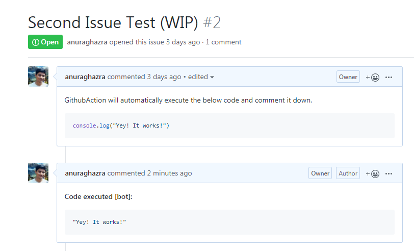
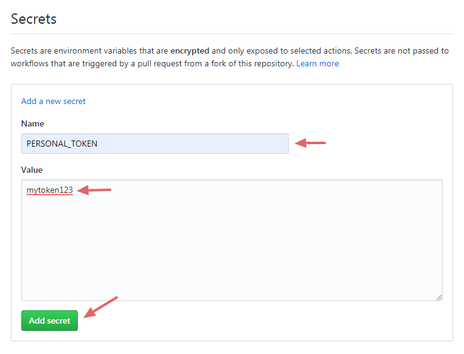
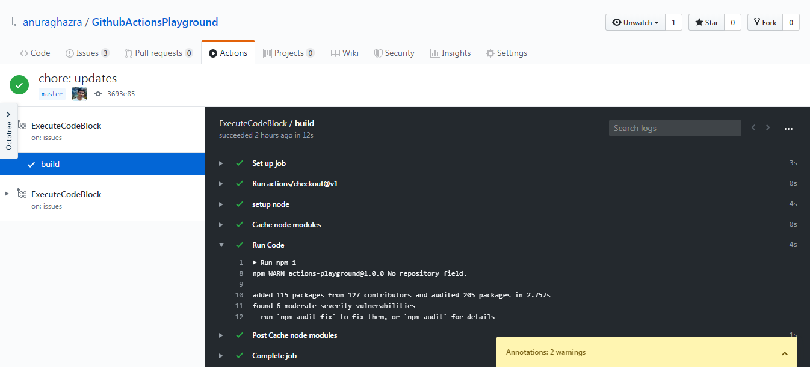

Let's get started, so you might say what are we going to do? Let's break it down:-

We are going to create a [GithubAction](https://github.com/features/actions) which will extract the markdown codeblock
*(js)* from the specified repo's issues and then execute the javascript and add a comment with the output.



## Setting Up

Let's start simply by installing all the required dependencies first.

**Initialize NPM:**

```sh
npm init
```

**Installing dependencies:**

- [@octokit/rest](https://www.npmjs.com/package/@octokit/rest)
- [markdown-parser](https://www.npmjs.com/package/markdown-parser)
- [vm2](https://www.npmjs.com/package/vm2)
- [dotenv](https://www.npmjs.com/package/dotenv)

We are going to use [@octokit/rest](https://www.npmjs.com/package/@octokit/rest) for fetching all the issues and for
commenting on the issues. octokit/rest provides a very nice wrapper around
[Github's API](https://developer.github.com/v3/).

```sh
npm i @octokit/rest
```

To parse the markdown and extract the codeblock we are also going to install
[markdown-parser](https://www.npmjs.com/package/markdown-parser).

```sh
npm i markdown-parser
```

Now maybe the most crucial package for this project, `vm2`.

vm2 is a sandbox that can run untrusted code with whitelisted Node's built-in modules. Securely!

> If you don't use vm2 then, someone could actually log your environment variables and get your access token and also execute any malicious code.

```sh
npm i vm2
```

Okay! Now we have everything set up nicely, let's get started.

## Setting up environment variables

To use Github's API to create comments and fetch the issues we are going to need a **Personal Access Token
(PERSONAL_TOKEN)**

Here's how you can
[create your Personal Access Token](https://help.github.com/en/github/authenticating-to-github/creating-a-personal-access-token-for-the-command-line)

> You should _not upload, share, or give Personal Access Tokens_ to anyone. Otherwise, someone could get access to your
> GitHub account.

**Using personal access token in local development:**

For this, we are going to use `dotenv`

In your root directory create a file called `.env` (without extension) and add this line to it with your personal token
which you generated previously.

After that, you should also create a
[.gitignore](https://github.com/anuraghazra/GithubActionsPlayground/blob/master/.gitignore) file so that your .env wont
get uploaded in GitHub.

```
PERSONAL_TOKEN=yourtoken123
```

And then, in index.js file require the dotenv module.

```js
// index.js
require('dotenv').config();
```

You might say okay that would work in my local machine but how will GitHub know about my personal access token then?
The answer is GitHub secrets.

To add a secret env variable to your GitHub repo go to your repo settings and you'll see a `secrets` tab like this and
Click "Add a new secret".


After clicking "Add a new secret" add a name of the secret "PERSONAL_TOKEN" and in value field, add your token.



Now we are all good to go, let's get started with the coding now.

## Let's Code Now

In the index.js file, we are going to require all the necessary dependencies 1st

```js
// index.js
const Octokit = require('@octokit/rest');
const Parser = require('markdown-parser');
const { VM } = require('vm2');

require('dotenv').config();
```

Now let's also initialize `VM2`

```js
// index.js

// initialize VM
const vm = new VM({
  timeout: 1000,
  sandbox: {},
  eval: false,
});
```

To work with Octokit let's authorize our PERSONAL_TOKEN and initialize Octokit, and also let's initialize
markdown-parser

```js
// index.js

// initialize markdown-parser
const parser = new Parser();

// initialize octokit
const octokit = new Octokit({
  auth: process.env.PERSONAL_TOKEN,
});
```

## Octokit

**Listing all the issues in the repo:**

To get all the issues of our repo, we are going to use octokit's API to fetch them.

You may have noticed we also used an [async function](https://javascript.info/async-await) to make things nice and
clean.

```js
// index.js

// get data
(async () => {
  const { data: issuesRes } = await octokit.issues.listForRepo({
    owner: 'username',
    repo: 'my-awesome-repo',
  });

  console.log(issuesRes); // all issues
})();
```

Now we need to loop through all the issues and parse the markdown to find the `markdown codeblock` and use `vm.run()` to run the codeblock.

```js
// index.js

// get data
(async () => {
  const { data: issuesRes } = await octokit.issues.listForRepo({
    owner: 'username',
    repo: 'my-awesome-repo',
  });

  // loop thought all the issues NOTE: PR are also considered as issues
  issuesRes.forEach((issue, index) => {
    let issueNumber = issue.number;
    let issueBody = issue.body;

    // parse markdown
    parser.parse(issueBody, function(err, result) {
      if (err) throw new Error(err);

      // we got the codeblock from the issue
      let code = result.codes[0].code.replace(/\n,/gim, '');

      // running the codeblock with vm.run()
      let res = vm.run(`${consoleOverwriteScript}\n${code}`)
      
      console.log(res);
    });
  });
  
})();
```

Almost done! Bare with me.

## Creating Comments

Now lastly, we need to create the comment with octokit's api, and we are all set.

```js
// index.js

// outside the async function add a new this new function
async function createComment(msg, issueNumber) {
  await octokit.issues.createComment({
    owner: 'username',
    repo: 'my-awesome-repo',
    issue_number: issueNumber,
    body: `**Code executed [bot]:**\n\n\`\`\`bash\n${JSON.stringify(msg)}\n\`\`\``
  })
}
```

`createComment` function will take the msg (outputted result of the code) and an *issueNumber* so it can comment on the right issue.

Let's continue with our code and finish it.

```js
// index.js

// inside async function
...
    // parse markdown
    parser.parse(issueBody, function (err, result) {
      if (err) throw new Error(err);
      // vm is acting weirdly when setting console log twice
      if (index > 0) consoleOverwriteScript = '';

      let code = result.codes[0].code.replace(/\n,/igm, '');
      let res = vm.run(`${consoleOverwriteScript}\n${code}`)

      createComment(res, issueNumber);
    })
...
```

Now you might notice a new variable called `consoleOverwriteScript`, it's kinda weird, and you should not do this in production apps.

What it does is, it will overwrite the native `console.log` functionality so it can also return the value it logged. see how it looks

```js
// index.js

// DONT DO THIS
let consoleOverwriteScript = `
console.oldLog = console.log;
console.log = function (value) {
  console.oldLog(value);
  return value;
};
`
```

I hope you understand what I'm doing here, and I know it's rather funky.

Now we are all good to go. If you run `node index.js`, you should see it working locally.


## Github Actions

Setting up Github Actions is relatively simple at this point because we already did everything else.

So let's jump right into it.

create a new folder in your root dir called `.github` and inside that create another directory called `workflows`


(just copy-paste this whole yml)

```yml
# .github/workflows/code.yml

# name of the action
name: ExecuteCodeBlock

# whenever a new issue is opened, edited, closed run this action
on:
  issues:
    types: [opened, edited, deleted, closed, reopened, labeled, unlabeled]

jobs:
  build:
    runs-on: ubuntu-latest

    # checkout
    steps:
      - uses: actions/checkout@v1

      - name: setup node
        uses: actions/setup-node@v1
        with:
          node-version: "10.x"

      # setup cache
      - name: Cache node modules
        uses: actions/cache@v1
        with:
          path: node_modules
          key: ${{ runner.os }}-node-${{ hashFiles('**/package-lock.json') }}
          restore-keys: |
            ${{ runner.os }}-node-
      
      # run our nodejs code
      - name: Run Code
        run: |
          npm i
          node index.js
        env:
          CI: true
          PERSONAL_TOKEN: ${{ secrets.PERSONAL_TOKEN }} # we already created this PERSONAL_TOKEN
```

YES! We are done, now push everything to GitHub and see the magic happen.

Whenever a new issue is opened, edited, closed, this action will run and comment down the output of the codeblock.

> here are a list of [all events that GithubActions supports](https://help.github.com/en/actions/automating-your-workflow-with-github-actions/events-that-trigger-workflows)



That's all, folks!

Hopefully, this post was helpful to you, and you learned something about "Github actions". Now i encourage you also to create your own Action and have fun with it. Tinker with things and also octokit's API to see what cool stuff you can also make. and if you created anything cool, don't hesitate to **share it with me.**

----

NOTE: I disabled GitHub action on this repo, so someone cleaver than me doesn't exploit anything.

**[See Full Code on GitHub](https://github.com/anuraghazra/GithubActionsPlayground)**


**Useful resources:-**

- [Octokit Docs](https://octokit.github.io/rest.js/)
- [Creating A Personal Access Token](https://help.github.com/en/github/authenticating-to-github/creating-a-personal-access-token-for-the-command-line)
- [Lots Of Actions](https://github.com/actions)
- [GitHub Actions now supports CI/CD, free for public repositories - Blog](https://github.blog/2019-08-08-github-actions-now-supports-ci-cd/)