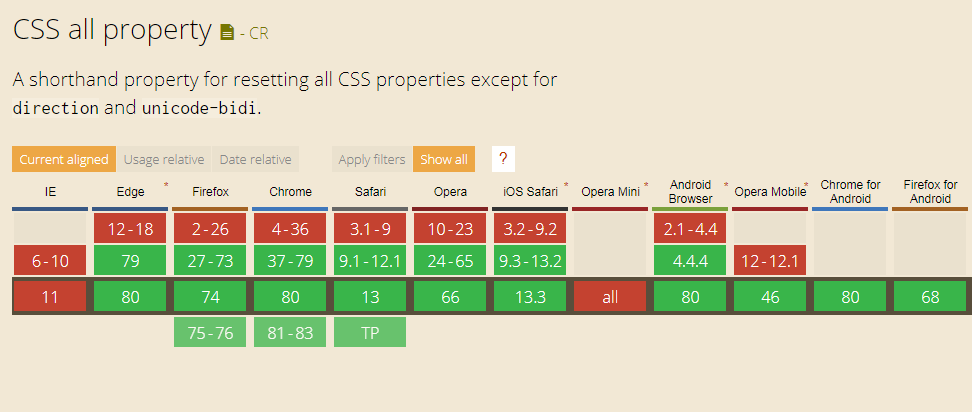

Hello... well, i'm back.

This is my first post in 2020 and today i'm going to talk about the unknown parts of CSS or should i say "lesser known" parts of CSS. 

Maybe i will make this a long topic in near future named **"The Unknown Parts of CSS"** but lets get into it.

Lets start with the `all` property. You might not heard of it but trust me CSS all property is really handy in some situations.

So you might be thinking what does `all` property do?

## What it does 🤔
CSS all property basically resets properties which are set previously in any element.

It is useful for making component-scoped CSS where you might want to reset all the properties of an element and start from scratch, or maybe sometimes you need to reset some styles instead of using `!important` everywhere. 

Here's a typical scenario where you want to reset the **a** tag's styles.

```css
a {
  border: 1px solid black;
  font-size: 24px;
}

a {
  /* it will reset all the previous styles 🤯 */
  all: unset;
}
```

Yup! that is really useful and handy.
the `all` property could take one of the following values

- **initial**  
    Specifies that all the element's properties should be changed to their initial values.
- **inherit**  
    Specifies that all the element's properties should be changed to their inherited values.
- **unset**  
    Specifies that all the element's properties should be changed to their inherited values if they inherit by default, or to their initial values if not. 


## Demo 🤯

https://codepen.io/anuraghazra/pen/VwLxaGV?default-tab=results,css

As you can see how the link is affected by the `all` property. and it resets the styles.

## Browser Support 📊

Browser support is also pretty nice with the exception of IE11 and Opera Mini. (rip them)



### Read more 📖

- [CSS Tricks All Property](https://css-tricks.com/almanac/properties/a/all/)
- [MDN Docs](https://developer.mozilla.org/en-US/docs/Web/CSS/all)
- [CanIUse Browser Support](https://caniuse.com/#feat=css-all)

🙏 Thanks for reading! hope you liked the post.
I will be writing more short blogs about CSS's unknown parts so stay tuned. Have a nice day bye! 👋

*Comment down if you want to see more tricks and tricks about CSS*