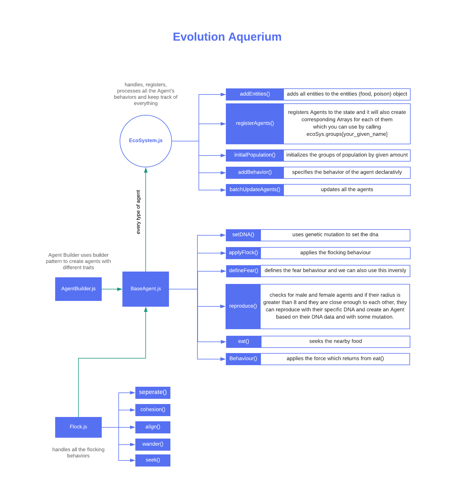

## How It Works?

These Creatures are based on [Craig Reynold's](https://www.red3d.com/cwr/index.html) Steering Behaviors and [Flocking System](https://www.red3d.com/cwr/boids/)

It also implements Genetic Algorithm and mutations.

You can learn more about them on Daniel Shiffman's YouTube Channel [The Coding Train](https://www.youtube.com/user/shiffman)

- [Coding Challenge #69.1: Evolutionary Steering Behaviors](https://www.youtube.com/watch?v=flxOkx0yLrY&t=1223s)
- [Coding Challenge #124: Flocking Simulation](https://www.youtube.com/watch?v=mhjuuHl6qHM&t=1978s)
- [Genetic Algorithm playlist The Nature of Code](https://www.youtube.com/playlist?list=PLRqwX-V7Uu6bJM3VgzjNV5YxVxUwzALHV)

---



## AgentBuilder Class

I make use of the "builder" pattern to create different varieties of creatures with different traits. And AgentBuilder class helps me do this easily see how it works.

> [Learn more how builder pattern works](https://medium.com/@axelhadfeg/builder-pattern-using-javascript-and-es6-ec1539182e24)

```js
class AgentBuilder {
  constructor(type) {
    this.acc = new Vector(0, 0)
    this.vel = new Vector(0, -2)
    this.type = type
  }
  setPos(x, y) {
    this.pos = new Vector(x, y)
    return this
  }
  setRadius(r = 5) {
    this.radius = r
    return this
  }
  setColor(color) {
    return (this.color = color)
  }
  setDNA(dna) {
    this.dna = dna
    return this
  }

  // ... more setFunctions

  build() {
    // returns a new BaseAgent based on the values
    return new BaseAgent(
      this.pos.x,
      this.pos.y,
      this.radius,
      this.dna,
      this.color,
      this
    )
  }
}
```

And now, the builder pattern is ready to be used. Let us see how we can build creatures with different traits.

```js
// later on
let Predator = new AgentBuilder("PREDATOR")
  .setRadius(10)
  .setMaxSpeed(2)
  .setMaxForce(0.05)
  .setHealthDecrease(0.002)
  .setColor([255, 0, 0])
  .setFoodMultiplier([0.5, -0.5])

let Avoider = new AgentBuilder("AVOIDER")
  .setRadius(5)
  .setMaxRadius(8)
  .setMaxSpeed(4)
  .setMaxForce(0.2)
  .setHealthDecrease(0.003)
  .setColor([255, 165, 0])
  .setFoodMultiplier([0.5, -0.5])
```

## BaseAgent Class

BaseAgent class handles all the logic for the update, render, and physics, it's the heart of the codebase. the basic idea is to give each `agent` some essential traits like `health`, `radius`, `maxSpeed`, `maxSpeed` etc etc.

> see the full BaseAgent class's [code at github](https://github.com/anuraghazra/EvolutionAquerium/blob/master/src/js/BaseAgent.js#L15)

```js
class BaseAgent {
  constructor(x, y, radius, dna, color, builder) {
    // for flocking behaviour
    this.pos = new Vector(x, y);
    this.acc = new Vector(0, 0);
    this.vel = new Vector(0, -2);


    // i used builder pattern to create more variaty agents easily
    if (builder === undefined) builder = {};
    this.builder = builder;

    // traits
    this.age = 1;
    this.health = 1;
    this.radius = radius || 5;
    this.maxSpeed = builder.maxSpeed || 1.5;
    this.maxForce = builder.maxForce || 0.05;
    // amout of health will decrease over time
    this.healthDecrease = builder.healthDecrease || 0.003;
    // amount of health will increase after eating food
    this.goodFoodMultiplier = builder.goodFoodMultiplier || 0.5;
    // amount of health will decrease after eating poison
    this.badFoodMultiplier = builder.badFoodMultiplier || -0.4;
    this.color = color;
    this.hasReproduced = 0;
    // randomly choose male or female
    this.sex = (random(1) < 0.5) ? 'MALE' : 'FEMALE';
    // females will be a bit bigger than male
    this.maxRadius = builder.maxRadius || ((this.getGender() === 'FEMALE') ? 15 : 10);

    // more code in between...

    // colors based on their gender
    if (!this.color && this.getGender() === 'MALE') this.color = [0, 170, 0];
    if (!this.color && this.getGender() === 'FEMALE') this.color = [255, 39, 201];

  }
```

Later on, I also gave them names, haha yes

```js
...
let names_female = [
  'hanna', 'mona', 'cutie',
  'sweety', 'sofia', 'rose',
  'laisy', 'daisy', 'mia'
];
let names_male = [
  'joe', 'jim', 'kim',
  'keo', 'shaun', 'morgan',
  'jery', 'tom', 'anu',
  'brian', 'ninja', 'daniel'
];

// names based on gender
this.name = (this.getGender() === 'MALE') ? this.getRandomName(names_male) : this.getRandomName(names_female);
...
```

And now, let's talk only about the main meat of the code, not any other unnecessary code.
so in the base class we have some methods

- [applyFlock()](https://github.com/anuraghazra/EvolutionAquerium/blob/master/src/js/BaseAgent.js#L235)

  applies the flocking behavior

- [defineFear()](https://github.com/anuraghazra/EvolutionAquerium/blob/master/src/js/BaseAgent.js#L184)

The primary function which defines the fear behavior and we can also use this inversely

- [eat()](https://github.com/anuraghazra/EvolutionAquerium/blob/master/src/js/BaseAgent.js#L271)

  seeks the nearby food

- [Behaviour()](https://github.com/anuraghazra/EvolutionAquerium/blob/master/src/js/BaseAgent.js#L215)

  applies the force which returns from eat()

- [reproduce()](https://github.com/anuraghazra/EvolutionAquerium/blob/master/src/js/BaseAgent.js#L320)

  Reproduction System checks for male and female agents, and if their radius is greater than 8 and they are close enough to each other, then they can reproduce with their specific DNA and creates a small Agent based on their DNA data and with some mutation.

## Flock Class

[Flock class](https://github.com/anuraghazra/EvolutionAquerium/blob/master/src/js/Flock.js) takes an agent and do the calculations for flocking behaviors like `separate`, `align`, `cohesion`, `seek`.

```js
class Flock {
  constructor(currentAgent) {
    this.currentAgent = currentAgent
    this.wandertheta = 0
  }

  seek(target) {}
  _returnSteer(sum) {}
  wander() {}
  separate(agents) {}
  align(agents) {}
  cohesion(agents) {}
}
```

## EcoSystem Class

EcoSystem class manages all the `agents` and `behaviors`, basically it is like a state manager

it has some methods which are

- [addEntities](https://github.com/anuraghazra/EvolutionAquerium/blob/master/src/js/EcoSystem.js#L17)

  adds all entities to the entities (food, poison) object

- [registerAgents](https://github.com/anuraghazra/EvolutionAquerium/blob/master/src/js/EcoSystem.js#L28)

  registers Agents to the state and also creates corresponding Arrays for each of them which you can use by calling ecoSys.groups[your_given_name]

- [initialPopulation](https://github.com/anuraghazra/EvolutionAquerium/blob/master/src/js/EcoSystem.js#L39)

  initializes the groups of population by the given amount

- [addBehavior](https://github.com/anuraghazra/EvolutionAquerium/blob/master/src/js/EcoSystem.js#L98)

  specifies the behavior of the agent declaratively

- [batchUpdateAgents](https://github.com/anuraghazra/EvolutionAquerium/blob/master/src/js/EcoSystem.js#L150)

  updates all the agents

```js
class EcoSystem {
  constructor() {
    this.groups = {} // agents
    this.entities = {} // generic container (food, poison)
    this.agents = {} // agent classes
    this.behaviors = {} // calculated behaviors
  }

  addEntities(names) {}
  registerAgents(agents) {}
  initialPopulation(init) {}
  addBehavior(config) {}
  batchUpdateAgents(list, foodPoison, weight, callback) {}
}
```


## Setting up everything

And the last step is to assemble every part of the code to create these boids like creatures and gave each of them behaviors

```js
// Global
let canvas = document.querySelector('#c');
let WIDTH = canvas.width = window.innerWidth;
let HEIGHT = canvas.height = 600;
let ctx = canvas.getContext('2d');


let MAX_CREATURES = 300;
const REPRODUCTION_RATE = 0.5;
const ENABLE_SUPER_DEBUG = false;

// constants for flexibilty
const CREATURE = 'CREATURE';
const PREDATOR = 'PREDATOR';
const AVOIDER = 'AVOIDER';
const EATER = 'EATER';
const FOOD = 'FOOD';
const POISON = 'POISON';

function load() {
  const ecoSys = new EcoSystem();

  // creates a Array which you can access with ecoSys.entities 
  ecoSys.addEntities({
    FOOD: [],
    POISON: []
  });

  // register classes it will also create corresponding Arrays
  // which you can use by calling ecoSys.groups[your_given_name]
  ecoSys.registerAgents({
    CREATURE: Agent,
    PREDATOR: Predator,
    AVOIDER: Avoider,
    EATER: Eater,
  });

  // initialPopulation have to use the same name
  // which you configure in registerAgents
  ecoSys.initialPopulation({
    CREATURE: 150,
    PREDATOR: randomInt(5, 10),
    AVOIDER: randomInt(10, 20),
    EATER: randomInt(1, 4),
  });

  let add = document.getElementById('addnew');
  canvas.addEventListener('click', function (e) {
    ecoSys.add(add.value, e.offsetX, e.offsetY)
  })

  //  ANIMATE LOOP
  function animate() {
    let grd = ctx.createRadialGradient(WIDTH / 2, HEIGHT / 2, 0, WIDTH / 2, HEIGHT / 2, WIDTH);
    grd.addColorStop(0, "rgba(25,25,25,1)");
    grd.addColorStop(1, "rgba(0,0,25,1)");
    // Fill with gradient
    ctx.fillStyle = grd;
    ctx.fillRect(0, 0, WIDTH, HEIGHT);

    /**
     * likes food dislikes poison
     * run away form predators and eaters
     * cloneItSelf
     */
    ecoSys.addBehavior({
      name: CREATURE,
      like: FOOD,
      dislike: POISON,
      fear: {
        PREDATOR: [-4, 75],
        EATER: [-2, 100]
      },
      cloneItSelf: 0.0015,
      callback: function () {
        if (ecoSys.groups.CREATURE.length < MAX_CREATURES
          && random(1) < REPRODUCTION_RATE) {
          this.reproduce(ecoSys.groups.CREATURE);
        }
      }
    });

    /**
     * likes poison dislikes food
     * seeks and eats creatures
     * run away from eaters
     */
    ecoSys.addBehavior({
      name: PREDATOR,
      like: POISON,
      dislike: FOOD,
      likeDislikeWeight: [1, -1],
      fear: {
        EATER: [-10, 50],
        CREATURE: [1, 200, function (agents, i) {
          agents.splice(i, 1);
          this.health += this.goodFoodMultiplier;
          this.radius += this.goodFoodMultiplier;
        }]
      },
    });

    /**
     * likes food dislikes poison
     * run away form predators, eaters, creatures
     */
    ecoSys.addBehavior({
      name: AVOIDER,
      like: FOOD,
      dislike: POISON,
      cloneItSelf: 0.0005,
      // likeDislikeWeight: [1, -1],
      fear: {
        CREATURE: [-0.9, 100],
        EATER: [-1, 100],
        PREDATOR: [-1, 100, function () {
          this.health += this.badFoodMultiplier;
        }]
      },
    });


    /**
     * likes poison
     * emits food as waste compound
     * seeks creatures, predators, avoiders and EATS THEM
     */
    ecoSys.addBehavior({
      name: EATER,
      like: POISON,
      dislike: POISON,
      likeDislikeWeight: [1, 1],
      fear: {
        CREATURE: [1.0, 100, function (list, i) {
          list.splice(i, 1);
          this.health += this.goodFoodMultiplier;
          this.radius += this.goodFoodMultiplier;
        }],
        PREDATOR: [1.0, 100, function (list, i) {
          list.splice(i, 1);
          this.health += this.goodFoodMultiplier;
          this.radius += this.goodFoodMultiplier;
        }],
        AVOIDER: [1.0, 100, function (list, i) {
          list.splice(i, 1);
          this.health += this.goodFoodMultiplier;
          this.radius += this.goodFoodMultiplier;
        }],
      },
      callback: function () {
        if (random(0, 1) < 0.05) {
          addItem(ecoSys.entities.FOOD, 1, this.pos.x, this.pos.y)
        }
      }
    });

    // UPDATE & RENDER
    ecoSys.render();
    ecoSys.update();
    renderItem(ecoSys.entities.FOOD, 'white', 1, true);
    renderItem(ecoSys.entities.POISON, 'crimson', 2);

    requestAnimationFrame(animate);
  }
  animate();

}

window.onload = load;
```


And that's it, phew, that was a lot of work. But in the end, we have beautiful flocking creatures playing around and interacting with each other. have fun watching them all day. <3